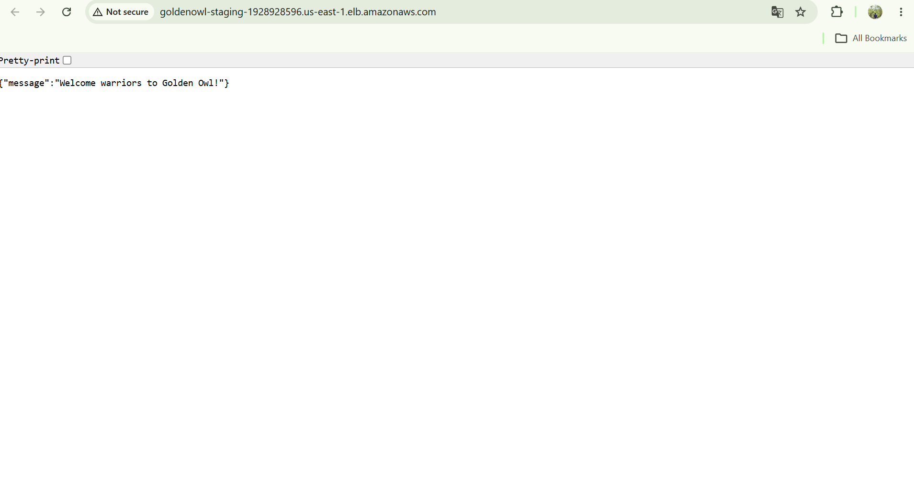
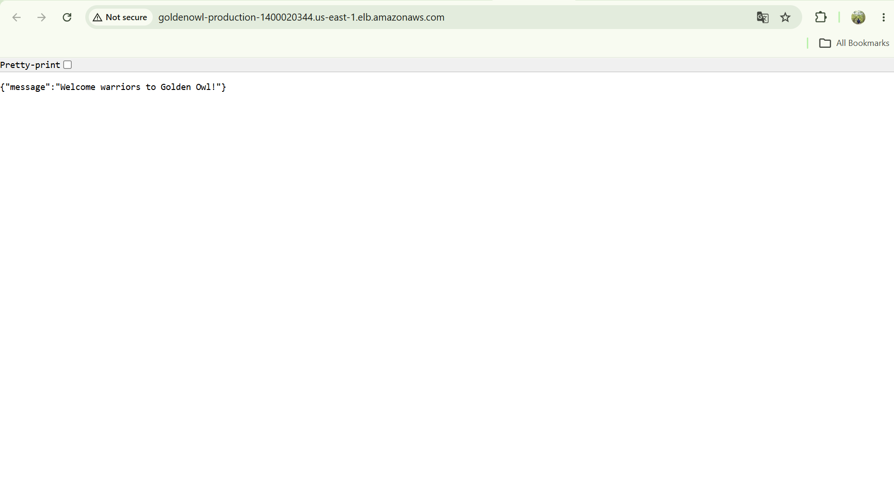

# Golden Owl DevOps Internship Challenge

This repository contains my solution for the Golden Owl DevOps Internship technical assessment. The existing Node.js service is packaged as a Docker image, tested with GitHub Actions, stored in Amazon ECR, and deployed to Amazon ECS Fargate.

## Deployment evidence

The staging and production endpoints were verified through separate Application Load Balancers. The screenshots are kept in the repository because the AWS Academy Learner Lab endpoints are temporary.

### Staging



### Production



Both environments were deployed with the same staging-approved image digest:

```text
sha256:693f380a28e21c73a94494c212968b68dd9036785ab1fea51a83fd1c23f5c110
```

## What was implemented

- Multi-stage Docker image with a distroless, non-root runtime
- GitHub Actions CI for feature branches and pull requests
- Image scanning with Trivy
- SPDX SBOM generation
- Keyless image signing and verification with Cosign
- Immutable image storage in Amazon ECR
- Separate staging and production ECS services
- Separate Application Load Balancers
- ECS Service Auto Scaling
- ECS deployment circuit breaker and automatic rollback
- Build-once promotion from staging to production
- Terraform modules for the network, ECR, and ECS environments
- Reusable composite GitHub Actions for common pipeline steps

## Architecture

The project uses one VPC across two Availability Zones. Staging and production have separate load balancers and ECS services but share the VPC and ECR repository.

```text
Internet
  |
  +-- Staging ALB
  |     |
  |     +-- ECS staging service (1-2 tasks)
  |
  +-- Production ALB
        |
        +-- ECS production service (2-4 tasks)

Shared resources
  +-- VPC
  +-- Two public subnets
  +-- Internet Gateway
  +-- Amazon ECR
```

The ECS tasks receive public IP addresses so they can pull images without a NAT Gateway. Their security groups only accept application traffic on port 3000 from the corresponding ALB security group.

ECS Fargate was selected instead of EKS because this assessment deploys a single service. Fargate provides the required container orchestration, rolling deployments, load balancing, and scaling without adding a Kubernetes control plane.

## Branch and release flow

```text
feature/**
    |
    v
staging
    |
    v
master
```

A push to `feature/**` runs CI. Pull requests into `staging` and `master` run the same validation checks.

When code reaches `staging`, the pipeline builds the image once, scans it, pushes it to ECR, signs it, deploys it to staging, and runs a smoke test. The verified image digest is then stored in AWS Systems Manager Parameter Store.

Production does not rebuild the image. After GitHub Environment approval, the production workflow reads the approved digest, verifies its staging signature, and deploys the same artifact.

```text
Feature push
  -> quality checks
  -> Docker build
  -> Trivy scan
  -> SBOM

Staging merge
  -> build once
  -> push to ECR
  -> resolve digest
  -> Cosign sign and verify
  -> deploy staging
  -> smoke test
  -> save approved digest

Master merge
  -> production approval
  -> read approved digest
  -> verify ECR image and Cosign signature
  -> deploy the same digest
  -> smoke test
```

This is a push-based GitHub Actions pipeline rather than a full GitOps setup. GitHub Actions registers new ECS task definition revisions and updates the ECS services directly.

## Continuous integration

The CI workflow runs the following checks:

```text
npm ci
Prettier check
ESLint check
Jest with coverage
npm audit for production dependencies
Hadolint
Docker build
Trivy secret scan
Trivy vulnerability scan
SBOM generation
```

Feature CI has read-only repository permission. It does not authenticate to AWS, push an image, or deploy an environment.

## Docker image

The dependency stage uses a pinned Node.js 24 Debian image and installs only production dependencies. The runtime stage uses a pinned distroless Node.js image.

The runtime container:

- Runs as UID and GID `65532`
- Has no shell or package manager
- Uses a read-only root filesystem in ECS
- Drops all Linux capabilities in ECS
- Contains only production dependencies and application files
- Uses a Node.js health check because the distroless image has no curl or wget

Build and run locally:

```bash
docker build -t goldenowl-app:local ./src
docker run --rm --name goldenowl-app -p 3000:3000 goldenowl-app:local
curl http://localhost:3000/
```

## Terraform

Terraform is split into four root stacks:

```text
infra/bootstrap
infra/live/shared
infra/live/staging
infra/live/production
```

The reusable modules are:

```text
infra/modules/network
infra/modules/ecr
infra/modules/ecs-environment
```

The bootstrap stack creates the S3 bucket intended for Terraform state. The bucket has encryption, versioning, blocked public access, bucket-owner-enforced ownership, and a TLS-only policy.

The live stacks use separate state keys:

```text
goldenowl/shared/terraform.tfstate
goldenowl/staging/terraform.tfstate
goldenowl/production/terraform.tfstate
```

The AWS Academy role used for the live demonstration denied the S3 object operations required by the Terraform backend. For that session, the live stacks were applied with Git-ignored local backend overrides. The tracked Terraform configuration remains set up for S3 remote state.

## ECS configuration

Staging:

```text
Desired tasks: 1
Minimum tasks: 1
Maximum tasks: 2
CPU target: 65%
```

Production:

```text
Desired tasks: 2
Minimum tasks: 2
Maximum tasks: 4
CPU target: 60%
```

Both services use rolling deployments. The deployment circuit breaker is enabled with automatic rollback. Terraform ignores the service task definition and desired count because those values are managed by the deployment pipeline and ECS Auto Scaling.

## Supply-chain checks

Trivy scans the repository for committed secrets and scans the built image for high and critical OS and library vulnerabilities. An SPDX JSON SBOM is uploaded as a workflow artifact.

Staging signs the immutable ECR digest with Cosign keyless signing. Production verifies that the signature belongs to the staging workflow on the `staging` branch before deployment.

AWS access uses temporary AWS Academy credentials stored in GitHub Environment secrets. No AWS credentials are stored in the repository.

## Running the application locally

```bash
cd src
npm ci
npm run format:check
npm run lint:check
npm test
npm audit --omit=dev --audit-level=high
npm start
```

In another terminal:

```bash
curl http://localhost:3000/
```
